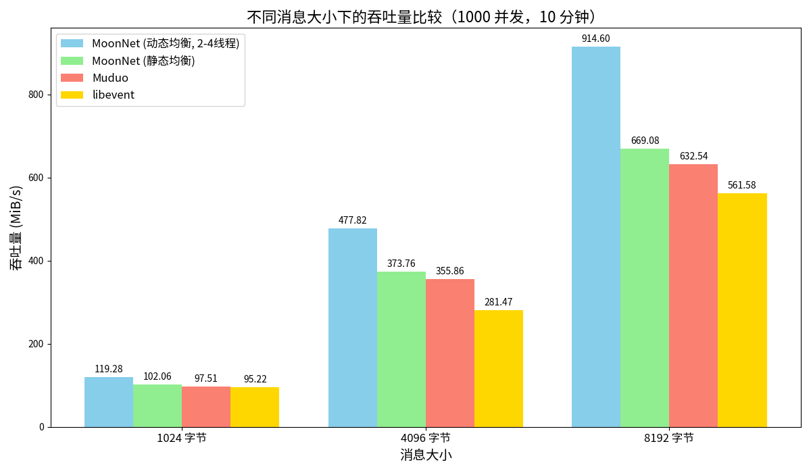

```c
              ____                                               ,--.
            ,'  , `.                                           ,--.'|                ___
         ,-+-,.' _ |                                       ,--,:  : |              ,--.'|_
      ,-+-. ;   , ||    ,---.      ,---.         ,---,  ,`--.'`|  ' :              |  | :,'
     ,--.'|'   |  ;|   '   ,'\    '   ,'\    ,-+-. /  | |   :  :  | |              :  : ' :
    |   |  ,', |  ':  /   /   |  /   /   |  ,--.'|'   | :   |   \ | :    ,---.   .;__,'  /
    |   | /  | |  || .   ; ,. : .   ; ,. : |   |  ,"' | |   : '  '; |   /     \  |  |   |
    '   | :  | :  |, '   | |: : '   | |: : |   | /  | | '   ' ;.    ;  /    /  | :__,'| :
    ;   . |  ; |--'  '   | .; : '   | .; : |   | |  | | |   | | \   | .    ' / |   '  : |__
    |   : |  | ,     |   :    | |   :    | |   | |  |/  '   : |  ; .' '   ;   /|   |  | '.'|
    |   : '  |/       \   \  /   \   \  /  |   | |--'   |   | '`--'   '   |  / |   ;  :    ;
    ;   | |`-'         `----'     `----'   |   |/       '   : |       |   :    |   |  ,   /
    |   ;/                                 '---'        ;   |.'        \   \  /     ---`-'
    '---'                                               '---'           `----'
```

[](https://github.com/MoonforDream/MoonNet/actions/workflows/ci.yml)&nbsp;
[](https://ci.appveyor.com/project/MoonforDream/moonnet/branch/master)&nbsp;
[](https://github.com/MoonforDream/MoonNet/releases/latest)


## 目录

- [简介中文版/Chinese](#chinese)
- [Overview英文版/Enlish](#en)
- [基准测试(Benchmark)](#benchmark)
- [使用示例(Example)](#example)
- [使用手册(Guide)](#guide)
- [贡献(Contributing)](#contributing)
- [加入我们(Join us)](#support)
- [许可证(License)](#license)
- [致谢(Thanks)](#thanks)


## 简介 (Chinese)

<a name="chinese"></a>
	

**MoonNet** 是一个专注于基于 Reactor 的高性能服务端网络库，提供基于主从 Reactor 多线程模型的服务端模块。它利用 Linux 的 `epoll` 机制，结合多线程和事件驱动设计，提供高效、可扩展的网络通信能力。MoonNet 支持 TCP 和 UDP 协议，并内置信号处理和定时器功能，提供丰富的组件如无锁环形缓冲区、无锁线程池等来构建服务器应用，适用于构建高并发、低延迟的服务器应用。

### 主要特性

- **高性能**：基于 `epoll` 的事件驱动模型，支持大量并发连接。
- **多线程**：主从 Reactor 模式，通过线程池管理多个事件循环，充分利用多核 CPU。
- **丰富的事件类型**：支持 TCP、UDP、定时器和信号事件。
- **丰富的组件模块**：提供丰富的组件去构建服务器应用，你可以灵活的使用MoonNet中的组件去灵活实现项目架构和具体实现
- **易于使用**：简洁的接口设计，方便集成到各种项目中。
- **静态/动态负载均衡**：提供静态和动态的负载均衡方案

### 安装

#### 前提条件

- C++11 编译器 或更高版本
- CMake 3.10 或更高版本
- Linux

#### 编译步骤

1. **克隆仓库**

   ```bash
   git clone https://github.com/MoonforDream/MoonNet.git
   cd MoonNet
   ```

2. **创建构建目录**

   ```bash
   mkdir build
   cd build
   ```

3. **运行 CMake**

   ```bash
   cmake ..
   ```

4. **编译**

   ```bash
   make
   ```

5. **安装**

   ```bash
   sudo make install
   ```

6. **引用头文件**

   ```cpp
   #include <moonnet/moonnet.h>
   ```

7. **清理**

   ```bash
   make clean-all
   ```

   


### 对比

| 特性           | MoonNet                | muduo                  | libevent         | Boost.Asio             | libuv                  |
| -------------- | ---------------------- | ---------------------- | ---------------- | ---------------------- | ---------------------- |
| **多线程支持** | 内置线程池管理         | 原生支持               | 需自行集成       | 原生支持               | 需自行管理             |
| **事件类型**   | TCP, UDP, 定时器, 信号 | TCP, UDP, 定时器, 信号 | TCP, UDP, 定时器 | TCP, UDP, 定时器       | TCP, UDP, 定时器, 信号 |
| **易用性**     | 简洁接口，模块化       | 接口复杂               | 丰富但复杂       | 功能强大但学习曲线陡峭 | 丰富且跨平台           |
| **性能**       | 高吞吐量，优化负载     | 高吞吐量               | 高性能           | 高性能                 | 高性能                 |
| **跨平台**     | Linux                  | Linux                  | Linux, Windows   | 跨平台                 | 跨平台                 |

MoonNet 通过简洁的接口设计和内置的多线程管理，提供了与传统高性能网络库相媲美的性能，同时降低了使用复杂度，适合需要高并发处理的服务器应用。


## Overview (English)

<a name="en"></a>

​		

**MoonNet** is a high-performance server-side network library focused on a Reactor-based model, offering server modules based on a master-slave Reactor multi-threaded model. It utilizes Linux's `epoll` mechanism, combined with multithreading and event-driven design, to provide efficient and scalable network communication capabilities. MoonNet supports TCP and UDP protocols and includes built-in signal handling and timer functions, offering a rich array of components such as lock-free circular buffers and lock-free thread pools for building server applications, suitable for creating high-concurrency, low-latency server applications.


### Key Features

- **High Performance**: Event-driven model based on `epoll`, supporting a large number of concurrent connections.
- **Multithreading**: Master-worker Reactor pattern with a thread pool managing multiple event loops, fully utilizing multi-core CPUs.
- **Rich Event Types**: Supports TCP, UDP, timer, and signal events.
- **Rich Component Modules**: Provides a rich set of components to build server applications, allowing you to flexibly implement project architecture and specific functionalities.
- **Ease of Use**: Simple interface design, easy to integrate into various projects.
- **Static/Dynamic Load Balancing**: Provides static and dynamic load balancing solutions

​	


### Installation


#### Prerequisites

- C++11 Compiler or higher
- CMake 3.10 or higher
- Linux

#### Build Steps

1. **Clone the Repository**

   ```bash
   git clone https://github.com/MoonforDream/MoonNet.git
   cd MoonNet
   ```

2. **Create Build Directory**

   ```bash
   mkdir build
   cd build
   ```

3. **Run CMake**

   ```bash
   cmake ..
   ```

4. **Build**

   ```bash
   make
   ```

5. **Install**

   ```bash
   sudo make install
   ```

6. **Reference header file**

   ```cpp
   #include <moonnet/moonnet.h>
   ```

7. **Clean**

   ```bash
   make clean-all
   ```

   

​	

### Comparison

| Feature                    | MoonNet                          | muduo                   | libevent             | Boost.Asio                        | libuv                   |
| -------------------------- | -------------------------------- | ----------------------- | -------------------- | --------------------------------- | ----------------------- |
| **Multithreading Support** | Built-in thread pool management  | Natively supported      | Requires integration | Natively supported                | Requires management     |
| **Event Types**            | TCP, UDP, Timer, Signal          | TCP, UDP, Timer, Signal | TCP, UDP, Timer      | TCP, UDP, Timer                   | TCP, UDP, Timer, Signal |
| **Ease of Use**            | Simple interface, modularization | Complex interfaces      | Rich but complex     | Powerful but steep learning curve | Rich and cross-platform |
| **Performance**            | High throughput, optimized load  | High throughput         | High performance     | High performance                  | High performance        |
| **Cross-Platform**         | Linux                            | Linux                   | Linux, Windows       | Cross-platform                    | Cross-platform          |

MoonNet offers performance comparable to traditional high-performance network libraries while reducing complexity through its straightforward interface design and built-in multithreading management, making it ideal for server applications requiring high concurrency.

​	


## 基准测试 (Benchmark)

<a name="benchmark"></a>

### 测试环境/Test Environment

- **服务器/Server**：阿里云 2 核 2G Ubuntu 服务器 /  Aliyun 2-core 2G Ubuntu server
- **测试工具/Testing Tool**：使用 muduo 的 pingpong 客户端 / Using muduo's pingpong client
- **测试方法/Methodology**：在 1000 个并发连接下，运行 10 分钟，分别测试不同消息大小的吞吐量 / Under 1000 concurrent connections, run for 10 minutes, testing throughput with different message sizes
- **测试目标/Test Target**：4线程的TCP回声服务器，动态均衡是以2-4线程进行动态调整的，代码见bench目录 / A 4-threaded TCP echo server, code can be found in the bench directory


### 测试结果/Test Results


#### 吞吐量比较/Throughput

| 并发数/Concurrency | 测试时长/Duration | 消息大小/Message Size | MoonNet(Dynamic) 吞吐量/Throughput | MoonNet(Static) 吞吐量/Throughput | muduo 吞吐量/Throughput | Libevent 吞吐量/Throughput |
| ------------------ | ----------------- | --------------------- | ---------------------------------- | --------------------------------- | ----------------------- | -------------------------- |
| 1000               | 10 分钟           | 1024 字节             | 119.28mib/s                        | 102.06 MiB/s                      | 97.51 MiB/s             | 95.22 MiB/s                |
| 1000               | 10 分钟           | 4096 字节             | 477.82mib/s                        | 373.76 MiB/s                      | 355.86 MiB/s            | 281.47 MiB/s               |
| 1000               | 10 分钟           | 8192 字节             | 914.60mib/s                        | 669.08 MiB/s                      | 632.54 MiB/s            | 561.58 MiB/s               |


### 数据可视化/Data Visualization

为了更直观地展示不同库的吞吐量差异，以下是测试结果的柱状图 / To better illustrate the throughput differences among different libraries, here is a bar chart of the test results：



## 使用示例(Usage Example)

<a name="example"></a>

以下我会将主要功能用一个服务器示例展现 / I will demonstrate the main functions using an example server as follows：

```cpp
#include <moonnet/moonnet.h>
#include <signal.h>
#include <iostream>

using namespace moon;


// signalevent callback / 信号事件回调函数
void handle_signal(int signo, server *ser){
    std::cout << "Caught signal " << signo << std::endl;
    // Close the server and clean up resources / 关闭服务器，清理资源
    ser->stop();
    std::cout << "TCP Echo Server Termination" << std::endl;
}

void handle_read(bfevent* bev){
    std::string str = bev->receive();
    // Or get inbuff / 或者获取输入缓冲区
    /* buffer* buff = bev->getinbuff();
    std::string s = bev->receive(buff->readbytes()); */
    bev->sendout(str);
    // write(bev->getfd(),str.data(),str.size());
}


void handle_write(){
    std::cout << "send success" << std::endl;
}

// UDP receive callback function / UDP 接收回调函数
void on_udp_receive(const sockaddr_in& addr, moon::udpevent* uev) {
    std::string data = uev->receive();
    if (!data.empty()) {
        std::cout << "UDP Received from " << inet_ntoa(addr.sin_addr)
                  << ":" << ntohs(addr.sin_port) << " - " << data << std::endl;

        // Send reply / 发送回复
        std::string reply = "Echo: " + data;
        std::cout << reply << std::endl;
        uev->send_to(reply, addr);
    }
}

// UDP other event callback function (e.g., error) / UDP 其他事件回调函数（如错误）
void on_udp_event() {
    std::cout << "An error occurred on the UDP connection." << std::endl;
}

// Server class constructor has set the connection callback in acceptcb_
// 服务器类构造函数已在 acceptcb_ 中设置了连接回调
int main() {
    // Initialize server, listen on port 5005 / 初始化服务器，监听端口 5005
    server srv;
    // Enable TCP service / 启用 TCP 服务
    srv.enable_tcp(5005);

    // Initialize thread pool and start dynamic balancing algorithm by default / 初始化线程池，默认启动动态均衡算法
    srv.init_pool();
    // Initialize thread pool with specified number of threads and enable dynamic balancing algorithm / 以指定线程数初始化线程池,并启用动态均衡算法
    //or
    // srv.init_pool(4,-1);
    // or 
    // Initialize thread pool without using dynamic load balancing algorithm / 不使用动态负载均衡算法初始化线程池
    // srv.init_pool_noadjust(4,-1);

    // Set TCP connection callbacks / 设置 TCP 连接的回调函数
    srv.set_tcpcb(handle_read, handle_write, nullptr);

    // Add signalevent / 添加信号事件
    std::vector<int> v = {SIGABRT, SIGFPE, SIGILL, SIGINT, SIGSEGV, SIGTERM};
    srv.add_sev(v, std::bind(handle_signal, std::placeholders::_1, &srv));
    // Or add signalevent / 或添加信号事件
//    signalevent sev(srv.getloop());
//    sev.add_signal(v);
//    sev.setcb(std::bind(handle_signal, std::placeholders::_1, &srv));
//    sev.enable_listen();


    // Add udpevent / 添加udp事件
    srv.add_udpev(5006, on_udp_receive, on_udp_event);

    // Start server / 启动服务器
    srv.start();

    return 0;
}
```


## 使用手册 (Guide)

<a name="guide"></a>

​	请参考 [MoonNet 使用手册](https://moonfordream.github.io/posts/MoonNet%E4%BD%BF%E7%94%A8%E6%89%8B%E5%86%8C/) 获取更详细的使用说明。

​	Please refer to the [MoonNet Guide](https://moonfordream.github.io/posts/MoonNet-guide-en/) for more detailed instructions


## 贡献 (Contributing)

<a name="contributing"></a>

对MooNet贡献方式如下：

1. Fork 仓库
2. 创建分支 (`git checkout -b feature/YourFeature`)
3. 提交更改 (`git commit -m 'Add some feature'`)
4. 推送到分支 (`git push origin feature/YourFeature`)
5. 创建 Pull Request

欢迎提交 **Pull Request** 和 **Issues**，您的贡献将帮助 MoonNet 变得更好！


Here are the ways to contribute to MoonNet.：

1. **Fork the Repository** 
2. **Create a Branch**(`git checkout -b feature/YourFeature`)
3. **Commit Your Changes**(`git commit -m 'Add some feature`)
4. **Push to the Branch**(`git push origin feature/YourFeature`)
5. **Create a Pull Request**

Feel free to submit **Pull Requests** and **Issues**; your contributions will help make MoonNet better!


## 加入我们 (Join us)

<a name="support"></a>

 可以通过以下方式联系我们，来加入我们：

1. 通过邮箱：moondream2144@gmail.com
2. 博客留言：https://moonfordream.github.io/about/


欢迎任何形式的贡献！另外我需要更多志同道合的伙伴(深入了解muduo、libevent等高性能网络库的，并且对MoonNet的开发贡献有很大的兴趣)，后期MoonNet需要添加以下功能和扩展：

- 提供并且支持主从reactor多进程的支持(进程通信等封装)
- 提供对http/https的支持
- 提供内置内存池(优化动态申请内存的性能)
- 提供对mysql、redis数据库等连接的连接池支持
- 提供内置异步日志库
- 提供tcp长连接支持(keep-alive和应用层心跳检测)
- 提供高负载时拒绝策略
- ........


You can join us by contacting us through the following ways:
1. By email: moondream2144@gmail.com
2. Blog comments: https://moonfordream.github.io/about/


All forms of contributions are welcome! Additionally, I am looking for more like-minded partners who have an in-depth understanding of high-performance network libraries such as **muduo**, **libevent**, etc., and who are highly interested in contributing to the development of MoonNet. In the future, MoonNet aims to add the following features and extensions:

- Provide and support master-slave reactor multi-process support (encapsulation of inter-process communication, etc.)
- Provide support for http/https
- Provide a built-in memory pool (optimize the performance of dynamic memory allocation)
- Provide connection pool support for databases like MySQL, Redis, etc.
- Provide a built-in asynchronous logging library
- Provide TCP long connection support (keep-alive and application-level heartbeat detection)
- Provide rejection strategies under high load
- ........


## 许可证 (License)

<a name="license"></a>

本项目采用 BSD 3-Clause 许可证。详情请参阅 [LICENSE](LICENSE) 文件。

This project adopts the BSD 3-Clause license. Please refer to the [LICENSE](LICENSE) document for details.


## Thanks
<a name="thanks"></a>

MoonNet 网络库的开发深受 [muduo 网络库](https://github.com/chenshuo/muduo) 的启发和影响.

在此对 muduo 的作者 **陈硕先生（Shuo Chen）** 表示由衷的感谢，感谢他对开源社区的卓越贡献。

The development of MoonNet network library is deeply influenced by [muduo network library]（ https://github.com/chenshuo/muduo ）Inspiration and influence
I would like to express my sincere gratitude to Shuo Chen, the author of Muduo, for his outstanding contributions to the open source community.

